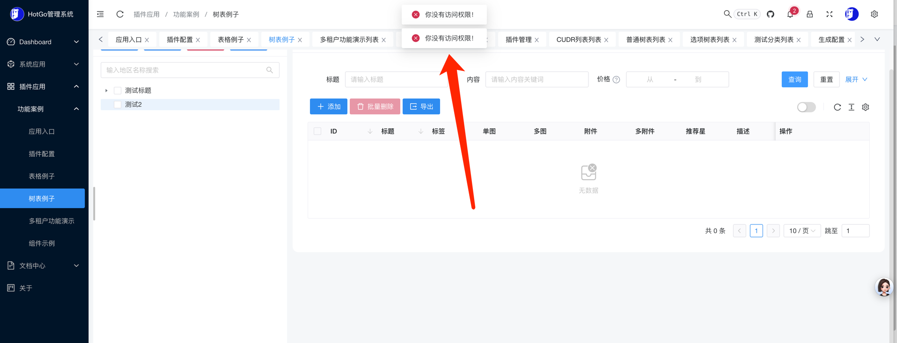
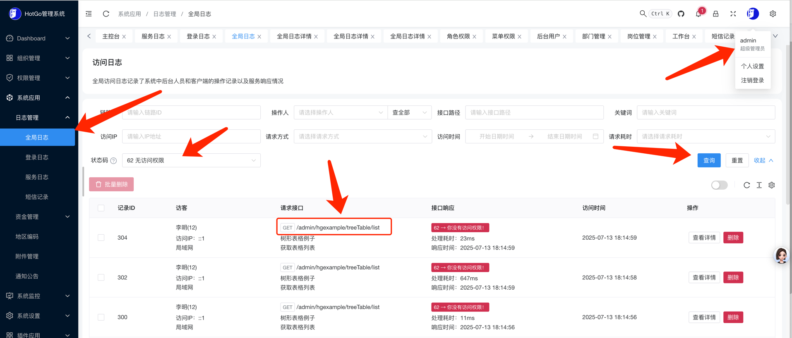
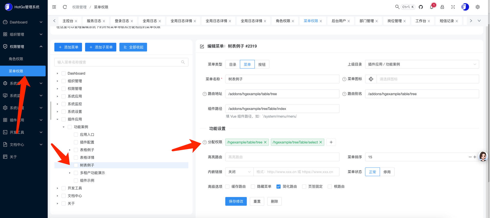
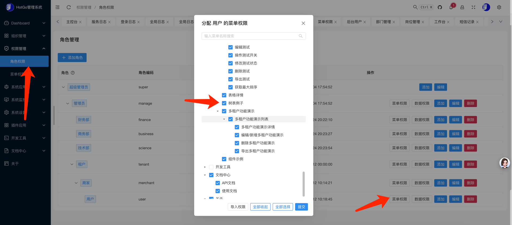

## 常见问题

目录

- 一、后台相关
- 二、数据库相关
- 三、环境相关


### 一、后台相关

#### 1、连接超时，请刷新重试。如仍未解决请检查websocket连接是否正确！

线上或非本地运行时，请到 系统设置 -> 配置管理 -> 基本设置 -> 找到网站域名和websocket地址，改成你自己实际的地址，保存刷新页面即可

#### 2、web页面菜单切换后页面出现白屏

请参考：https://github.com/jekip/naive-ui-admin/issues/183


### 二、数据库相关

#### 1、安装数据库出现 json 报错不支持

请安装 mysql5.7 及以上版本的数据库。如果你使用的是mariadb请确认版本号，mariadb从 10.2 版本开始支持 json 数据类型。


### 三、环境相关

#### 1、not found in resource manager or following system searching paths

> 报错信息：panic: possible config files "config" or "config.toml/yaml/yml/json/ini/xml/properties" not found in resource manager or following system searching paths:

系统没有找到配置文件，将配置文件 `manifest/config/config.yaml.bak` 复制后改为`manifest/config/config.yaml`


#### 2、net.DialTimeout failed with network

> 报错信息：connect to 127.0.0.1:8099 error: net.DialTimeout failed with network "tcp", address "127.0.0.1:8099", timeout "10s": dial tcp

- http服务没有启动或正在启动
- 通过一键启动所有服务运行时属正常情况，多服务启动时存在先后顺序问题，`tcpClient`比`tcpServer`先启动完成导致的，等`tcpServer`启动完成后会自动重连

详细请参考 - [系统安装](start-installation.md)


#### 3、cannot find "hack/config.yaml" in following paths:
> 报错信息：get cli configuration file:hack/config.yaml, err:cannot find "hack/config.yaml" in following paths:

系统运行目录下配置hack/config.yaml文件。如果是生产环境运行，并且不需要开发工具相关功能，可以将`manifest/config/config.yaml`配置文件中的`system.mode`值改为`product`，这样启动时不会加载开发工具相关功能

#### 4、非超管角色提示：你没有访问权限！


此问题因当前角色访问的页面包含未分配权限的接口所致，在多角色场景中较为常见，解决步骤如下：

1. 定位缺失权限的接口
- 用超管账号进入系统应用 -> 日志管理 -> 全局日志，搜索状态码为`62 无访问权限`的记录
- 示例：若请求接口为`/admin/hgexample/treeTable/list`，需处理的权限路径为`/hgexample/treeTable/list`（去除`/admin`前缀）



假如查到请求接口是：`/admin/hgexample/treeTable/list`，那需要分配的菜单权限就是：`/hgexample/treeTable/list`,要把`/admin`去掉

2. 配置菜单权限
- 进入权限管理 -> 菜单权限：
- 若目标菜单不存在，先新增菜单
- 若菜单已存在但未配置接口权限，就把步骤1中的权限路径添加到【分配权限】中（已配置则跳过）
  


3. 分配权限给角色
- 进入权限管理 -> 角色权限，找到对应角色并点击【菜单权限】
- 勾选步骤2中配置的菜单权限，保存即可



### 四、前端相关

#### 1、Error: connect ECONNREFUSED ::1:8000

```text
11:44:52 [vite] http proxy error at /member/info:
Error: connect ECONNREFUSED ::1:8000
    at TCPConnectWrap.afterConnect [as oncomplete] (node:net:1246:16)
```

- 服务端没有启动
- `.\wen\.env.development`中的`VITE_PROXY`配置的服务器地址或端口与实际不一致


